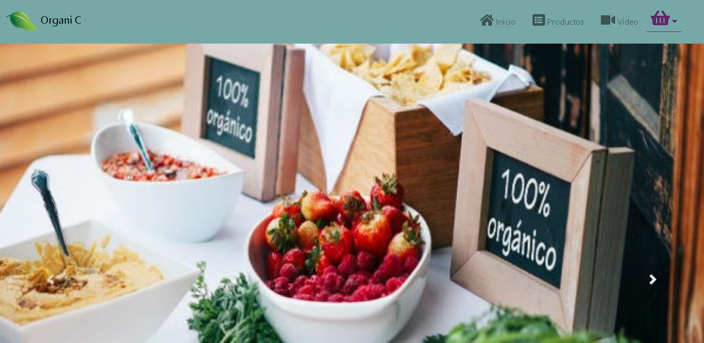
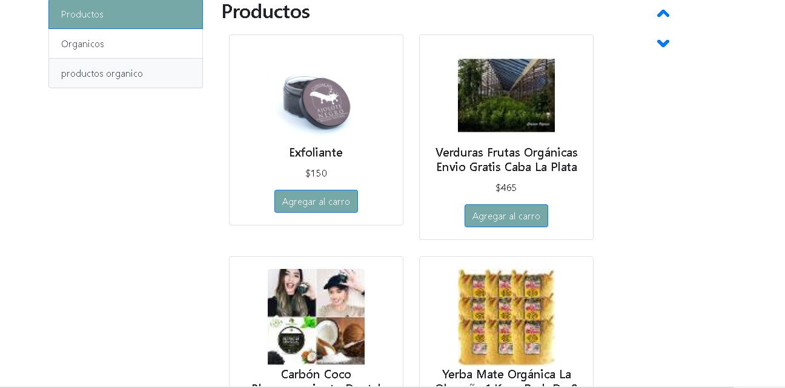
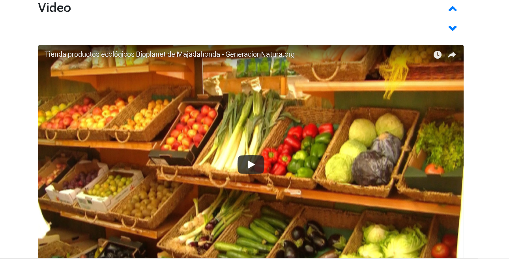

# Organic

> Es una web app e-commerce dedicada alos productos organicos ya que cada dia se vuelve un reto en encontrar productos saludables, asi como articulos 100% de producctos naturales, para eso cree "Organic"

## EL RETO

>Como reto final de este curso deberás crear una app web bajo los principios de SPA (Single page aplication).

Para ello debes entender y aplicar los siguientes conceptos.

Templating
Routing (URLs)
DOM & Event Handling (State)
Patrón de arquitectura de software (MV*)
Los cuales se te darán como guía teórica.

Tu reto será desarrollar una app e-commerce, para ello utilizarás.

API de productos (Descripción, precios, etc). Si gustas puedes usar la de Mercado Libre

API que permita la compra por parte del usuario, que puede ser Paypal, Stripe o cualquier otra que encuentres que sirva para lo mismo.

Desarrolla el producto teniendo como guía visual a este diseño.
Interactúa con la página para que veas el proceso de compra.

Despliega tu repositorio a GH Pages explicando en qué consiste el reto en tu archivo README.md

***

### Descripción

> Es una web app e-commerce dedicada alos productos organicos ya que cada dia se vuelve un reto en encontrar productos saludables, asi como articulos 100% de producctos naturales, para eso cree "Organic"

***
Para poder realizar comprar se requiere una cuenta prueba:

> Email ID:Testing1-buyer@hotmail.com

> Contraseña: 12345678

***

## Desarrollado para 
[Laboratoria](http://laboratoria.la)

***

###

